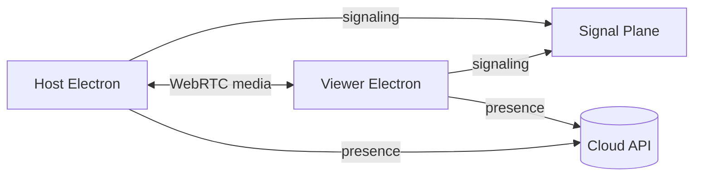

# PC Remote Desktop

[](https://github.com/LongVanDEV/pc-remote-desktop)
[](LICENSE)
[](#)
[](#)
[](#)
[](https://github.com/LongVanDEV/pc-remote-desktop)

> Enterprise-grade remote desktop for power users. Low latency. End-to-end encrypted. Built like we meant it.

```text
  ____   ____   ____                       _        
 |  _ \ / ___| |  _ \ ___ _ __ ___   ___  | |_ ___  
 | |_) | |     | |_) / _ \ '_ ` _ \ / _ \ | __/ _ \ 
 |  __/| |___  |  _ <  __/ | | | | | (_) || ||  __/ 
 |_|    \____| |_| \_\___|_| |_| |_|\___/  \__\___| 
```

## Features

| Feature | Status | Notes |
|--------|--------|-------|
| Ultra-low latency screen share | ✅ | Adaptive bitrate, 60 FPS capable |
| Multi-monitor selection | ✅ | Hot-switch without reconnect |
| Clipboard sync | ✅ | Text + files (bounded) |
| Background host / tray mode | ✅ | Auto-start optional |
| Invite codes | ✅ | Short-lived, rate-limited |
| Ban list (HWID / IP / email) | ✅ | Device + global scopes |
| Admin console | ✅ | Fleet overview |
| Announcements | ✅ | Multi-post, realtime |
| File transfer | ✅ | Chunked, resumable |
| TURN fallback | ✅ | When P2P is blocked |

## Architecture



### High-level layout

```text
pc-remote-desktop/
├── apps/
│   ├── desktop/          # Electron shell
│   ├── host-core/        # Capture + encode pipeline
│   └── viewer-core/      # Decode + input injection
├── packages/
│   ├── signaling/        # Room + SDP helpers
│   ├── crypto/           # Session key exchange wrappers
│   ├── ui/               # Shared panels
│   └── config/           # Feature flags
├── services/
│   ├── edge-gateway/     # Public API facade (stub)
│   └── metrics/          # Telemetry sink (stub)
├── docs/                 # Design notes & RFCs
└── scripts/              # Dev / release helpers
```

## Quick start

```bash
git clone https://github.com/LongVanDEV/pc-remote-desktop.git
cd pc-remote-desktop
npm install
npm run bootstrap
npm run dev
```

> **Note:** This public tree is a **demo / marketing shell**. Runtime binaries and production backends are provisioned separately for licensed deployments.

## Security

- Sessions require mutual authentication before media starts
- Signaling payloads are treated as untrusted
- Invite codes are single-use and expire quickly
- See [SECURITY.md](SECURITY.md) for reporting

## Roadmap

- [x] Host / viewer split
- [x] Adaptive quality presets
- [x] Admin announcements
- [ ] Mobile companion (viewer-only)
- [ ] Wayland capture improvements
- [ ] Hardware encode on more GPUs

## License

Proprietary. All rights reserved. See [LICENSE](LICENSE).

---

<p align="center">
  <sub>Built for people who still believe remote desktop can feel local.</sub>
</p>
